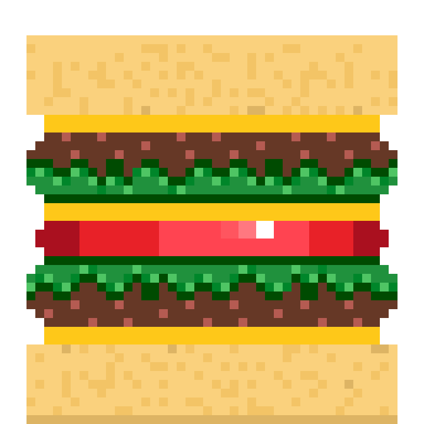
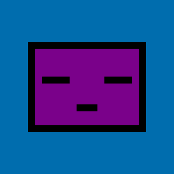

<h1 align ="center"> SAND-wich</h1>

    

 

<em>NFTs are just pixelated sandwiches! <b>#ProveMeWrong</b></em>

 

## Overview

Have you ever seen NFT collections such as <a href ="https://opensea.io/collection/boredapeyachtclub">The Bored Ape Yacht Club</a> or <a href ="https://opensea.io/collection/cryptopunks">Cryptopunks</a> and wondered:
  
  ><em><h4>How these artists can mint their art so fast and so well organized without risking the quality in the process?! 🤔</h4></em> 
  
If you have, well, the short answer is by applying <a href ="https://www.lighthouselabs.ca/en/blog/how-python-is-used-in-automation">**Automation**</a> to their <a href="https://www.britannica.com/technology/standardization">**Standardized Artworks**</a>

Now, if you are wondering:
  
  ><em><h3>Oh nice! How do I do that? I'm just starting... 🤷‍♂️</h3></em> 

I'm glad to introduce **SAND-wich** 🥪 to you!
  
It's an open-source software built on Python that aims to help both new and well-experienced artists in the making of NFT collections.
  
It is capable of merging any number of layers following an specific order (provided by you), and export every single result to a folder as an independent file and also a dataframe that contains the NFTs metadata used in the process.
 
By using **SAND-wich**, you are making your work more productive and organized because of the nature of applying **Automation and Standarization** to your Art. 
🗿  

  - **Technology stack**: Python 3.9.6 [MSC v.1929 64 bit (AMD64)], Pandas 1.3.1, Itertools, PIL 8.4.0.
  - **Status**:  0.1.0
  - **Executable**: https://github.com/noahverner1995/SAND-wich/blob/main/exe/SAND-wich.exe
  - **What makes this software different from others?** The ease of use and the brand concept behind it.

## Installation

**If you are a developer**, you will first have to have installed `Python 3.9.6` or later with the following dependencies: `Pandas 1.3.1` or later, `Itertools`, `PIL 8.4.0` or later. Then you can copy the code from the `SAND-wich.py` file and run it in your preferred environment.
    
**If you ARE NOT a developer**, you will first have to deactivate your Antivirus for then <a href ="https://github.com/noahverner1995/SAND-wich/blob/main/exe/SAND-wich.exe">downloading the exe file</a>. Then you can execute the program by clicking on it and pressing ↵Enter.

## Usage

First of all, you need to make sure that you already have an ***Standardized NFT Model*** made with **Adobe Photoshop**, such as this one down below:

    

<b>Download this Standardized NFT Model</b><a  href ="https://github.com/noahverner1995/SAND-wich/blob/main/Sample/Sample.psd"> <b>HERE 👀</b></a>

 

Then, you open that model using **Adobe Photoshop**, then select the `Zoom` 🔍 tool, then move your mouse over the icon in the center of your screen, and then hold down `Left-Click` until it's big enough, then you will see something like this:

    

All right, now you will create the following folders at your desired `path`:

    

<em>Make sure to name these folders with the same</em>

<em>name of the layer groups, respectively!</em>

<em><b>#KeepItOrganized</b></em>

 

Then, you will hide all the layers in the `.psd` except one, such as `Yellow` in this case:

    

Then, you will `export` as `.png`  that layer to the corresponding folder (`Background`, in this case) at the `path` you set:

    

<em>Again, make sure to name these files with the same</em>

<em>name of the layers, respectively!</em>

<em><b>#KeepItOrganized</b></em>

 

You will repeat the previous process with every single layer, individually. Once done, you will execute `SAND-wich.exe` by selecting it with `Left-Click` and pressing ↵Enter:

    

<em>Remember to have your antivirus deactivated when doing so</em>

<em>Otherwise, this won't work as expected. 🧐</em>

It will display the following program:

    

Now you will copy the `path` at where your exported layers are located:

    

And paste into the `SAND-wich.exe` input:

    

Then press ↵Enter:

    

The program will print first the name of the folders (in purple) together with its corresponding files (in light blue) from the `path` you passed as input, then it will print a dictionary (which is a data structure) that contains the all the previous information inside.

Then it will ask you if you want to add 'None' as value in one or several folders (keys) of the dictionary, this will be useful if you want to create an NFT collection with some series of images that won't have a particular feature. If you don't want to do this, just type `n` and press ↵Enter, else, you type `y` and press ↵Enter, and then type the name of the folder (key) in which you want to have 'None' as value and press ↵Enter, it will ask you again if you want to add another one or not, you decide from there.

    

All right, this part explains why this project was named as `SAND-wich` (*sort of*). 😉
 
 
A sanwdich 🥪 is an orderly sequence of elements, that usually starts and finishes with a slice of bread 🍞.
 
Just like a sandwich, the creation of your NFTs must follow an specific order to be created, otherwise `SAND-wich` may export **abominations** 🧟. 
